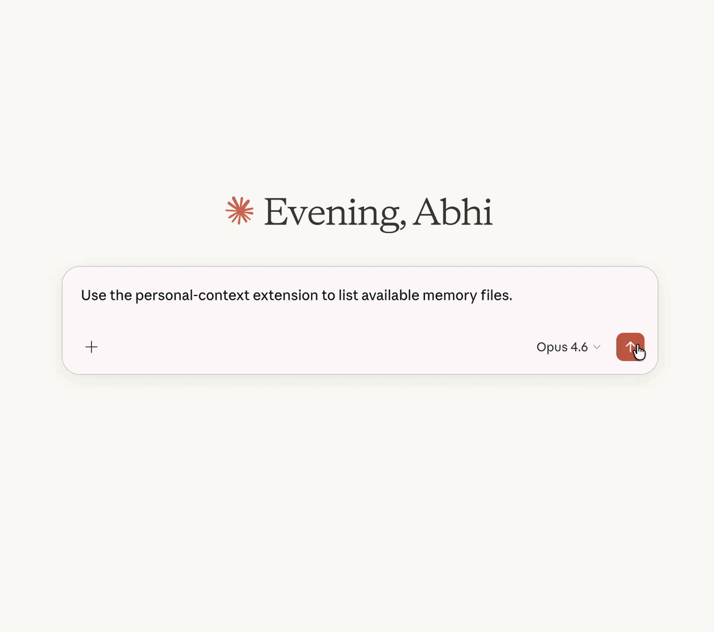

# Personal Context MCP

A Markdown-first MCP for Claude Desktop that makes AI memory portable, structured, and user-owned.

What if Claude could wake up inside a memory system you actually own?

`personal-context-mcp` gives Claude a local folder of Markdown context: durable truths, live priorities, rough notes, and reviewable updates. Claude can search it, build a focused brief before work starts, and capture new observations without turning them into permanent truth by accident.

Instead of trusting an opaque app memory, you get a small personal context layer you can inspect, edit, version, copy, and take with you.

## The 10-Second Version

Without this: every important chat starts with you re-explaining who you are, what matters, how you work, and what is currently going on.

With this: Claude can run `wake_up_context`, read the right local Markdown sections first, and start the task with the context that matters.

## In Action



The cool part is the loop: search what matters, wake up with the right bundle, capture rough notes safely, then promote only the pieces that earn trust.

Want the product shape in five minutes? Read the [V2 demo walkthrough](./docs/v2-demo-walkthrough.md).

## Why Use It

This is most useful if you:

- use Claude heavily
- switch between multiple AI workflows
- want continuity across sessions and projects
- care about user-owned memory instead of product-owned memory lock-in
- want important context to stay reviewable in plain files

## What Makes This Different

This project is intentionally opinionated:

- Markdown-first, so the memory layer stays portable and inspectable
- `core / dynamic / inbox`, so durable truth, working memory, and tentative notes do not get mixed together
- human-reviewable, so important context is visible and editable in plain files
- trust-aware, so rough notes can be captured without pretending they are durable truth
- local by default, so your filled portfolio stays under your control

The point is not "more memory." It is a more inspectable path from rough context to useful context, while keeping durable truth protected.

That is the core bet: the best AI memory is not invisible. It is readable, local, and curated.

## V2 Surface

The current V2 surface turns the project from a basic Markdown memory bridge into a fuller personal-context workflow:

- **Ranked search:** `search_memory` finds relevant files and sections with transparent ranking reasons.
- **Wake-up bundles:** `wake_up_context` builds a small trust-aware bundle before a task starts, so Claude can read the right context first.
- **Durable context wrappers:** `writing_style_context`, `product_positioning_context`, and `outbound_framing_context` give common high-value prompts explicit entry points.
- **Manual ingestion:** `manual_ingest` captures pasted notes, transcript excerpts, and rough summaries into low-trust inbox memory with visible provenance.
- **Review and promotion:** `promote_raw_note`, `mark_raw_note_status`, and `link_raw_note_to_proposal` let rough notes move toward reusable memory without erasing their trail.
- **Safer dynamic maintenance:** dynamic files can be appended to, bootstrapped, or updated through exact section/item operations instead of broad rewrites.

The upgrade is not just more tools. It is a tighter loop:

1. Ask Claude what context exists.
2. Search and rank the right Markdown sections.
3. Build a focused read-first bundle.
4. Capture rough notes into low-trust inbox memory.
5. Promote only reviewed context into reusable working memory.

## Memory Model

This project uses a simple three-layer memory model:

- `core/`
  Durable truth. Identity, positioning, communication style, operating rules.
- `dynamic/`
  Working memory. Current priorities, active campaigns, recent learnings, message tests, account patterns.
- `inbox/`
  Low-trust notes. Rough observations, partial ideas, and proposed core updates.

This separation is the key design choice: stable truth, evolving memory, and uncertain notes should not collapse into one blob.

## Tool Surface

| Tool | Surface | Purpose |
| --- | --- | --- |
| `status` | read-only | Show memory health, writable surfaces, and available tools. |
| `list_memory_files` | read-only | List portfolio files Claude can inspect. |
| `read_memory_file` | read-only | Read one specific memory file. |
| `search_memory` | read-only | Search files and sections with ranked matches and ranking reasons. |
| `wake_up_context` | read-only | Build a compact, trust-aware context bundle for a task. |
| `writing_style_context` | read-only | Pull writing-style context for drafting, rewriting, and editing tasks. |
| `product_positioning_context` | read-only | Pull product and positioning context for strategy or messaging work. |
| `outbound_framing_context` | read-only | Pull outbound framing context for prospecting and outreach work. |
| `manual_ingest` | `inbox/` write | Capture pasted notes into low-trust memory with provenance. |
| `append_memory_entry` | `dynamic/` write | Append a durable learning to an approved dynamic section. |
| `maintain_dynamic_item` | `dynamic/` write | Replace or remove one exact bullet or dated entry. |
| `replace_dynamic_section` | `dynamic/` write | Replace one approved dynamic section. |
| `bootstrap_dynamic_memory` | `dynamic/` write | Bootstrap dynamic memory from reusable conversation evidence. |
| `mark_raw_note_status` | `inbox/` write | Mark raw notes reviewed or promoted without deleting the source note. |
| `promote_raw_note` | `dynamic/` or `inbox/` write | Promote one reviewed raw note into a learning or core-update proposal. |
| `link_raw_note_to_proposal` | `inbox/` write | Link a raw note to an existing core-update proposal. |
| `propose_core_update` | `inbox/` write | Propose protected core changes without editing `core/` directly. |

## Privacy Boundary

The starter portfolio in this repo is intentionally blank and safe to copy. Your filled personal context portfolio is private data.

Do not commit your filled portfolio to a public repo. The default quickstart name, `my-personal-context-portfolio/`, is ignored by this repo, but if you choose another name, keep it outside Git or add it to your own `.gitignore` before filling it in.

See [PRIVACY.md](./PRIVACY.md) for the privacy model.

## Requirements

- Claude Desktop with local extensions enabled
- Node.js 20 or newer
- npm

## Install

See [QUICKSTART.md](./QUICKSTART.md).

```bash
git clone https://github.com/abhinavkalyan10/personal-context-mcp.git
cd personal-context-mcp
npm install
npm run install:extension
npm run prepare:extension
```

Then install `.build/claude-extension/personal-context` as an unpacked extension in Claude Desktop.

## Repo Structure

```text
.
├── assets/
├── desktop-extension/personal-context/
├── lib/
├── mcp/
├── scripts/
├── starter-personal-context-portfolio/
├── tests/
├── QUICKSTART.md
└── package.json
```

## What This Is Not

This is not magical autonomous memory.

It does not replace:

- judgment
- selective curation
- periodic cleanup
- manual review of durable truth

It also does not add embeddings, a vector database, a knowledge graph, or automatic background writes.

## Project Docs

- [QUICKSTART.md](./QUICKSTART.md): install and validation walkthrough
- [docs/v2-demo-walkthrough.md](./docs/v2-demo-walkthrough.md): short guided tour of the V2 workflow
- [CHANGELOG.md](./CHANGELOG.md): release history
- [PRIVACY.md](./PRIVACY.md): privacy model and data boundaries
- [SECURITY.md](./SECURITY.md): security policy

## Suggested One-Line Description

> Personal Context MCP is a portable, Markdown-based memory system for Claude Desktop that separates durable context, working memory, and low-trust notes so AI assistants can stay useful without trapping memory inside one product.

## License

MIT
